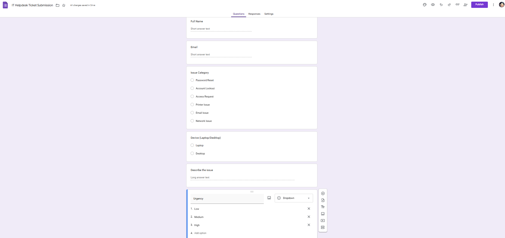
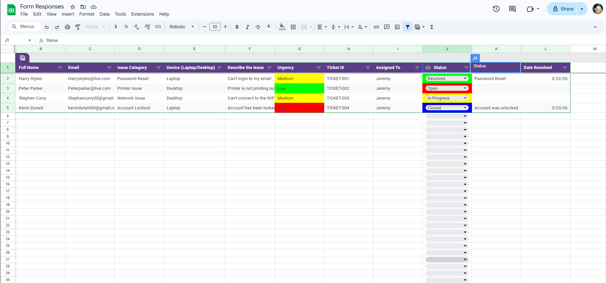

# My Own HelpDesk Ticketing System

## Overview
Built and managed a helpdesk ticketing system using Google Forms and Sheets, tracking incidents, assigning tickets, and documenting resolutions.

## Features

- Ticket submissions through Google Forms
- Tickets are assigned and prioritized
- Status tracking (Open, In Progress, Resolved, Closed)
- Ticket assignment and resolution tracking
- Ticket Priority filtering and sorting

## Workflow
1. A User submits a ticket through the form
2. Ticket is logged automatically in a dashboard
3. Tickets are assigned and prioritized
4. Status is updated throughout resolution
5. Resolution notes and dates are updated and recorded

# What was used 
- Google Forms
- Google Sheets

## Skills demonstrated 
- IT Helpdesk workflows
- Ticket management systems
- Incident response and prioritization
- Troubleshooting documentation
- Data organization and filtering

# Screenshots 

